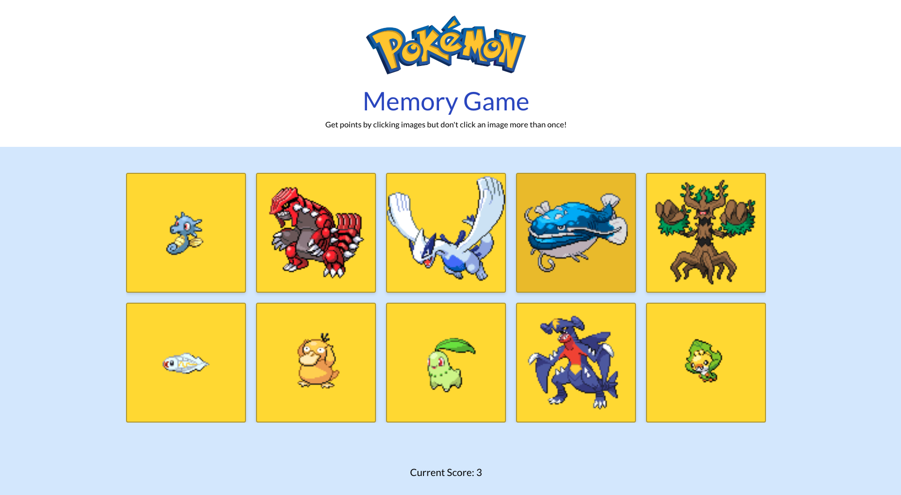

# Pokémon Matching Game

Try it live: [pokemon-memory-card-game-ck.netlify.app](https://pokemon-memory-card-game-ck.netlify.app/)



A memory card game built with React, Vite, and Tailwind CSS. Test your memory by clicking on Pokémon cards. Try not to click the same Pokémon twice!

## Features
- 10 random Pokémon cards per round
- Score tracking and reset on duplicate click
- Game over modal with your score
- Responsive, modern UI with Tailwind CSS
- Images and data fetched from the PokéAPI

## How to Play
1. Click on a Pokémon card to earn a point.
2. Don't click the same Pokémon twice in a round!
3. If you click a duplicate, the game ends and your score is shown.
4. Click "Close" on the modal to start a new round.

## Getting Started

### Prerequisites
- Node.js (v16 or higher recommended)
- npm

### Installation
```bash
npm install
```

### Running the App
```bash
npm run dev
```
Then open [http://localhost:5173](http://localhost:5173) in your browser.

## Project Structure
- `src/` — React components and styles
- `public/` — Static assets
- `App.jsx` — Main app logic and modal
- `components/MyGrid.jsx` — Board and game logic
- `components/Card.jsx` — Card display

## Technologies Used
- [React](https://react.dev/)
- [Vite](https://vitejs.dev/)
- [Tailwind CSS](https://tailwindcss.com/)
- [PokéAPI](https://pokeapi.co/)

## Credits
- Pokémon images and data from [PokéAPI](https://pokeapi.co/)
- Pokémon logo and branding © Nintendo, Game Freak, and The Pokémon Company

---
Enjoy playing and improving your memory with the Pokémon Matching Game!
